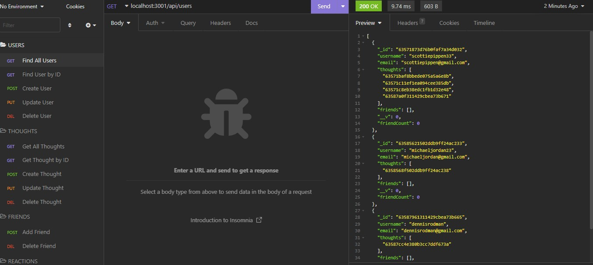

# Social-Network

## Back-end project showing the functionality of a social-networking application- creating users, thoughts, and reactions.  

[Demo Video](https://watch.screencastify.com/v/PT0WejH8xutvNYXmqRdK)

Used 'node' to run application, 'express' for the server, 'mongo' for database management, 'mongoose' for database manipulation, and 'insomnia' to test the request to ensure functionality. 

